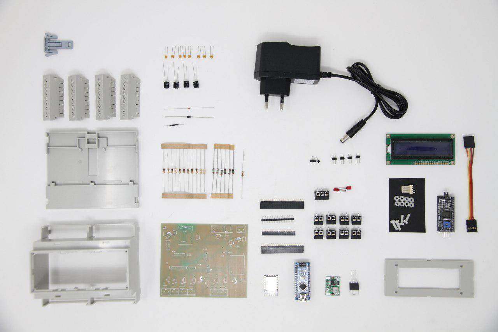
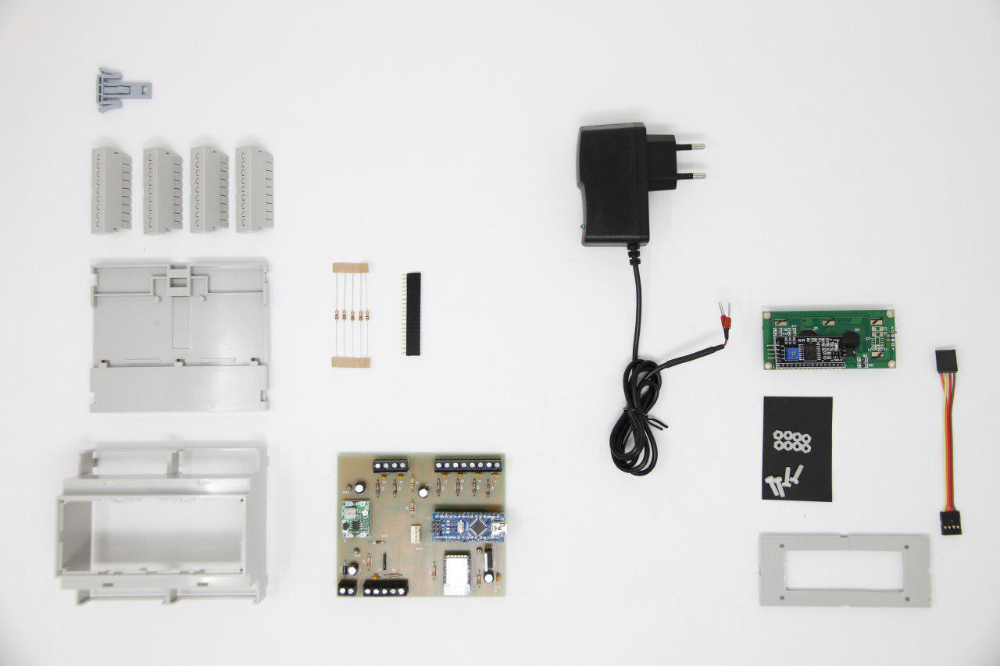

# EcoHouse

Este kit de medida está pensado para tomar las medidas de consumo eléctrico de una vivienda o de un edificio con consumos inferiores a 10 KW. El sistema permite diferenciar varias zonas.
EcoHouse se puede instalar en el cuadro eléctrico principal o en cualquier otra parte  que nos permita tomar datos del consumo mediante pinzas (transformadores de intensidad). 
En el un edificio podemos tener tantos dispositivos como sean necesarios y el servidor EcoEficiencia los integrará en la misma instalación sin necesidad de configuraciones adicionales o cambios en el Firmware.
La comunicación se hace mediante Wifi por lo que no es necesario el cableado de datos al equipo solamente es necesario que esté dentro de la cobertura de la red WIFI del edificio. 
Para su uso no son necesarios conocimientos de informática aunque todos los desarrollos y el hardware están hechos bajo licencias libres lo que permite la modificación y mejora de las funcionalidades.

## Listado con las principales características
Las principales características de EcoBuilding son:
- 6 entradas para sensores de corriente con salida estandar de 50 mA o 1 Voltio
- Comunicación a Internet por WIFI local
- Configurable vía Web
- Display para mostrar el consumo instantáneo
- Alimentación a 220 voltios de corriente alterna
- Montaje en carril din
- Es posible configurar dos entradas analógicas adicionales pero en este caso el display permanecerá inoperativo
- La PCB integra un Arduino nano  con el ESP8266 12E
- Compatible con el [servidor de Open Energy Monitor](https://emoncms.org/)

## Montaje
El listado de componentes que has debido recibir es el siguientes:

- 1 PCB con los componentes de superficie ya montados
- 1 Carcasa para carril DIN
- 1 Tapa superior carcasa con display LCD 1602 y adaptador IIC/I2C
- 1 PCB Mesh building
- 1 Fuente de alimentación a 12 voltios
- 1 Arduino Nano
- 1 Integrado ESP8266 12E con el firmware mesh_building incluido
- 1 Convertidor DC-DC Step Down ajustable (salida 7,5V)
- 1 Regulador de tensión LM 1117
- 2 Conectores macho -hembra de 2.0mm para el ESP
- 2 Conectores macho hembra de 2.54mm para Arduino
- 2 Conectores macho hembra de 2.54mm para al display
- 9 Terminales de tornillo para PCB
- 2 Resistencias 10k 
- 3 Condensador 22uF
- 1 Condensador de 100nF
- 1 Diodo 1N4007

## Montaje
Partiendo de la PCB con los componentes de superficie soldar los componentes de menor a mayor tamaño por este orden:
- Convertidor DC-DC Step Down ajustable (salida 7,5V)
- Resistencias 10k 
- Diodo 1N4007
- Convertidor DC-DC Step Down ajustable (salida 7,5V)
- Conectores macho -hembra de 2.0mm para el ESP
- Conectores macho hembra de 2.54mm para Arduino
- Conectores macho hembra de 2.54mm para al display
- Terminales de tornillo para PCB
- Condensador 22uF
- Condensador de 100nF
- Regulador de tensión LM 1117
 
Una vez esta completa la PCB insertar los integrados en sus posiciones
- Integrado ESP8266 12E
- Arduino Nano

Mirar la imagen para colocar los integrados de forma correcta, de otra maner no funcionarán y pueden sufrir daños

Por último conectar la tapa superior con el display a la PCB y montar la carcasa.

## Puesta a punto
La puesta a punto de libre_building consta de dos partes:
- El ajuste del voltaje de trabajo
- La configuración en la instalación

### El ajuste del voltaje de trabajo
El ajuste del voltaje de trabajo se hace para adaptar cualquier alimentación al voltaje de trabajo de EcoHouse que es 7,5 voltios.
La fuente de alimentación suministrada es de 12 voltios aunque el dispositivo funciona correctamente siempre que el voltaje de trabajo quede configurado entre 7 y 9 voltios.
Una vez conectada la  fuente de alimentación medir el voltaje en el punto (W103), situado al lado de  el Convertidor DC-DC (U1), y ajustarlo a 7,5 voltios con el potenciómetro que incorpora el convertidor. 

## La configuración en la instalación
En este punto se definen los parámetros del servidor de destino y la wifi local a la que va a estar conectado el libre_building. 
Con este fin, la primera vez que se ponga en servicio el ESP y siempre que no encuentre la WIFI configurada, el ESP 8266 12E creará su propio punto de acceso, su propia red WIFI . Conectandose a cualquier dirección a través de este punto de acceso nos aparecerá la página de configuración del ESP. Tengase en cuenta que una  vez configurado el ESP y conectado a una red WIFI el router le asignará una única dirección IP a la que será necesario acceder para cambiar la configuración.
El firmware de Arduino
El firmware que que esta cargado por defecto en el arduino nano funciona correctamente sin embargo si quiere cambiar la configuración puedes encontrar la última actualización del firmware en este repositorio:[ecohouse-nano ](https://github.com/iotlibre/Ecohouse/tree/master/ecohouse-arduino_1)

